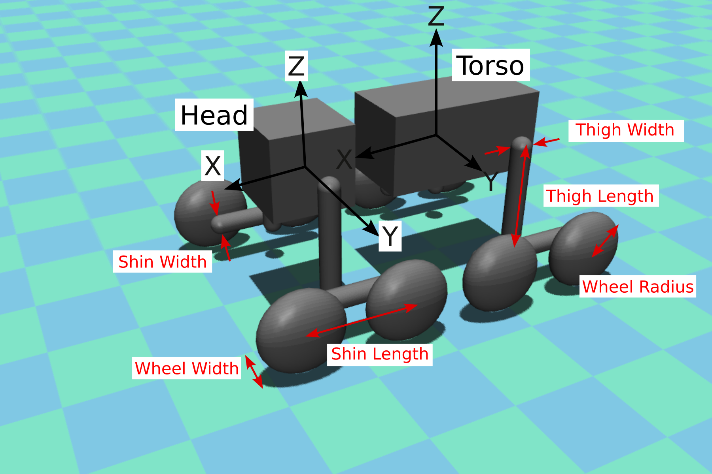
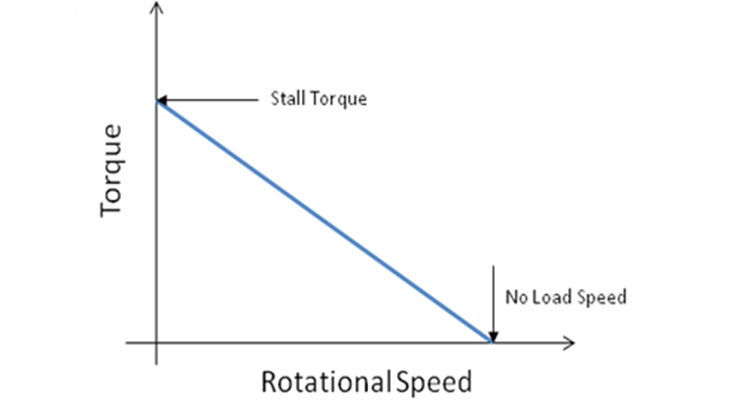
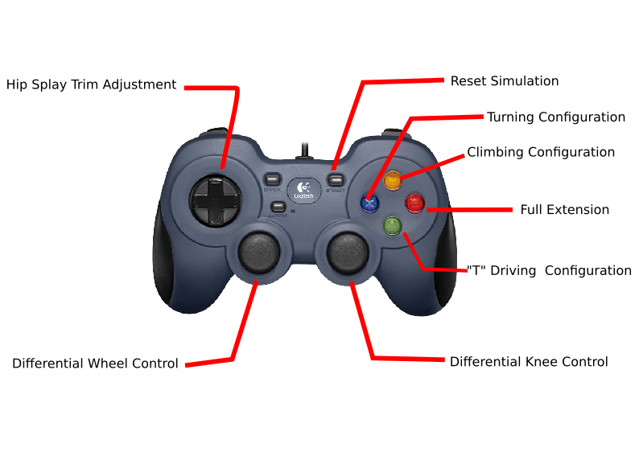

# Full Scale WaLTER Simulation Program

## Setup and Installation (Linux)
To begin, make sure that Python 3.12 or later is installed. You will also need either a Logitech gamepad or a PS4 controller connected to the computer with a micro usb cable. The simulation will not run without a controller connected.

Use the following command to check:

``` python --version ```

With the proper Python version installed, navigate to the directory you'd like to store the entire project folder.
For example, you may want the package to be stored in your 'Documents' folder or on your desktop for easy access.

Once in the desired directory, clone the repository using the following commands:

``` git clone git@github.com:dmj17b/Brax_WS.git```

Now that the repository is cloned, navigate into the folder "Brax_WS" that was just created.

Once in the workspace, create a python virtual environment. You may need to install additional Python packages for this to work.

``` python -m venv env ```

"env" will be the name of the Python environment folder that stores all the packages related to this project. You can name this directory whatever you want, but for this tutorial I will be using env.

To activate (source) the Python environment, run the following command:

```source env/bin/activate```

Most terminal environments will use color changes or an added (env) to each line to let you know you've activated the environment properly.

Now that the virtual environment is set up and properly sourced, we can install the required python packages using pip.

To triple check before installing a bunch of dependencies to the wrong place, I like to run

```pip --version```

This command should return a path leading deeper into your 'env' folder, ensuring that the packages are only being installed for this environment, not the entire computer.

Now, you can install the packages needed to run the program.

```pip install -r requirements.txt```

Now all the required dependencies should be installed and you can run the program.

## Running the Simulation

To run the simulation, first make sure you are in the Brax_WS directory, your Python virtual environment is activated, and the gamepad is plugged into the computer. Then you can run:

```python FeasibilitySim.py```

This should open a MuJoCo window where you can pan, zoom, and orbit with your mouse. It also allows you to adjust other visual aspects of the simulator. From here, you can pilot the robot according to the prescribed joystick policy.


## Adjusting Model Parameters:
Model parameters like sizes, masses, and frictions can be edited in "model_config.yaml"

The programatic model generation occurs in "AutoSim.py". If you need to add additional parameters that aren't considered in the yaml file, this is where you would do so. 

To help understand how the model is generated, it is important to know that everything builds off of the rear body segment, which will be referred to as the "torso." The torso is aligned with its length along the x-axis, width along the y-axis, and height along the z-axis.



The head is defined similarly to the torso, but includes an `offset` term to define its position relative to the torso. The offset term is 3-dimensional but we'll likely only be adjusting the x-offset to play with head-torso spacing. To facilitate size variation, the torso and head both use MuJoCo "box" primitives.

The thigh and shin linkages use MuJoCo's "capsule" primitive which uses a length and width parameter to create a pill-shaped geometry. 

The thigh parameters include an offset term so users can adjust the positioning of the hip joint relative to the head/torso. The `torso_offset` and `head_offset` are 3-dimensional vectors relative to the torso and head origins. In the programatic model generation, a minimum y-offset is added to each of these offset to account for body and linkage thicknesses. Any offset added in the yaml file will add to this base offset.

The shin/thigh joint is always assumed to be at the bottom of the thigh and middle of the shin. An additional, 3D offset vector is included, but we recommend only varying the y-component of the shin offset to add more/less tolerance between the linkages.

The wheels of this system are approximated using MuJoCo "ellipsoid" primitives. Users can adjust the radius and width of these wheel primitives to get different sizes of wheels. Like the shin, the wheels include a 3D offset term, but it is recommended to only use the y-component of this offset to preserve the model's intended morphology.

Given the importance of contact modeling between the wheels of the robot and other surfaces, the wheels include two additional modeling parameters in the yaml file:
1. `friction`: The friction parameter of the wheels includes 3 terms, representing planar friction, torsional friction, and rolling friction in that order. For more information, visit: [MuJoCo XML Reference: friction](https://mujoco.readthedocs.io/en/stable/XMLreference.html#body-geom-friction) 
2. `solref`: This parameter is used in MuJoCo to adjust the contact dynamics between geometries. The two values in the solref array are [time_constant, damping_ratio]. These values allow us to model "squishy" wheels that absorb impacts. For more information, visit: [MuJoCo XML Reference: solref](https://mujoco.readthedocs.io/en/stable/modeling.html#reference)

### Important Notes for Model Parameters:
- ALL inertias are approximated by the assigned mass and associated geometry. It is possible to assign a full inertial matrix, but this is left out for now.
- Any unassigned parameters are set to MuJoCo defaults.
- 


## Adjusting Motor Models and Joint Parameters:
Motor models and joint parameters can be found and edited in "motor_config.yaml"

In this file you can adjust the following:

Hip and Knee Actuators:
- `Kp`: P-gain for joint-level position PD control (applied in lib/MotorModel.py)
- `Kd`: D-gain for joint-level PD control (applied in lib/MotorModel.py)
- `stall_torque`: Stall torque for the MOTOR ONLY (N*m)
- `no_load_speed`: No-load-speed (radians/sec)
- `gear_ratio`: TOTAL gear ratio from actuator to joint
- `rotor inertia`: Inertia of motor rotor (kg*m^2)
- `damping`: Damping coefficient to be applied to the entire joint 

Wheels:
- `Kp`: P-gain for joint-level VELOCITY PD control (applied in lib/MotorModel.py)
- `Kd`: D-gain for joint-level PD control (currently un-used)
- `stall_torque`: Stall torque for the MOTOR ONLY (N*m)
- `no_load_speed`: No-load-speed (radians/sec)
- `gear_ratio`: TOTAL gear ratio from actuator to joint
- `rotor`: inertia: Inertia of motor rotor (kg*m^2)
- `damping`: Damping coefficient to be applied to the entire joint (N*s/m)

Waist:
- `spring_stiffness`: Stiffness of the passive torsional waist spring (N/m)
- `damping`: Damping coefficient to be applied to the joint (N*s/m)
- `range`: joint limits [min,max] (degrees)

### IMPORTANT NOTES ABOUT MOTOR MODELS

>1. Motor parameters are specific to the MOTOR itself. If you decide to use any pre-packaged actuators, you will need to extract/approximate these values accordingly
 >> - Ex: if the stall torque of an actuator is listed at 60 Nm, but the actuator has an internal gearing of 6, you will need to list the stall torque as 10Nm and gear reduction as 6
  >>- Ex: if the above actuator has an additional 3:1 reduction from the actuator output to the joint, the gear_reduction would be 18 and the stall torque would remain at 10 Nm


>2. Motor models currently assume a simple linear speed-torque relationship according to the following graph:

 > - Again, the motor parameters shown in this graph are specifically BEFORE ANY reductions occur so that we can get proper reflected inertia values

>3. Damping is the only parameter that is applied to the joint as a whole. Since it is difficult to know this value without physical testing, we choose to leave this parameter as a lumped term for any damping/losses in the transmission.

>4. Waist parameters are included in this config file, but the waist DOES NOT use any actuator. The waist parameters are strictly for simulating a torsional spring-damper system with a limited joint range. In the future we may experiment with actuating this joint, but that functionality is not included yet.

## Joystick Control Scheme:
For reference, here is the current joystick control layout I use. The buttons can be pre-programmed for any specific configuration by editing lib/JoystickControl.py
Still working on a better way to make this program automatically detect different joysticks and use the appropriate controls.



## Implementing Custom Control Schemes:
To use the existing speed-torque motor model, you can comment out any lines relating to joystick control, and send joint commands in the main loop with the following schema:

`motor_name.pos_control(pos_target)`

`motor_name.vel_control(vel_target)`

or

`motor_name.torque_control(target_torque)`

All three of these control schemes can be used (although gains may need to be adjusted when switching between position and velocity control) without any additional modification to the control script. The motor names are already defined in the script.

Alternatively, you can directly send joint torques and further manipulate simulation data in the mjData object, d. To learn more, visit [MuJoCo Programming Reference: mjData](https://mujoco.readthedocs.io/en/stable/APIreference/APItypes.html#mjdata). This data structure holds all simulation information and can be used to extract most simulated values of interest (positions, velocities, joint torques, etc.) It is important to note, however, that if you 'go around' the existing motor model by directly manipulating mjData, the actuators will not have any defined limits. Actuator limitations are currently implemented soley in lib/MotorModel.py

## Troubleshooting
><ins>**Problem:**</ins> Unable to interact with or scale UI window. No minimize/expand/close buttons on the window. Using Ubuntu.
>><ins>**Solution:**</ins> MuJoCo uses X-Org instead of Wayland for window instantiation. Log out and ensure that your computer is using X-11/X-Org instead of Wayland.

><ins>**Problem:**</ins> Errors in joystick control or mapping:
>><ins>**Solution:**</ins> In the main script, where the joystick control is initialized, make sure the correct gamepad is selected. If this does not work, or you are using a new type of joystick/gamepad, you will need to parse the joystick commands yourself in lib/JoystickControl.py
